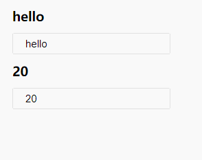

## react-hooks-input-bind
React hook for creating input values. Implement two-way binding of data.

> Note: This is using the new [React Hooks API Proposal](https://reactjs.org/docs/hooks-intro.html) which is subject to change until React 16.7 final.
> You'll need to install react, react-dom, etc at ^16.7.0-alpha.0

### Install

```bash
npm install react-hooks-input-bind
npm install react@^16.7.0-alpha.0 react-dom@^16.7.0-alpha.0
```

### Usage

```js
import useBind from 'react-hooks-input-bind';

export default () => {
    const [state, bind] = useBind({
        name: 'hello',
        age: '20',
    });

    return (
        <div>
            <h3>{state.name}</h3>
            <input {...bind.name} />

            <h3>{state.age}</h3>
            <input {...bind.age} />
        </div>
    )
}
```




The initial value can also be a string, an array, a numeric value, and so on.

```js
const [state, bind] = useBind(20);
<input {...bind} />

const [state, bind] = useBind('hello');
<input {...bind} />

const [state, bind] = useBind([20, 21]);
<input {...bind[0]} />
<input {...bind[1]} />
```

